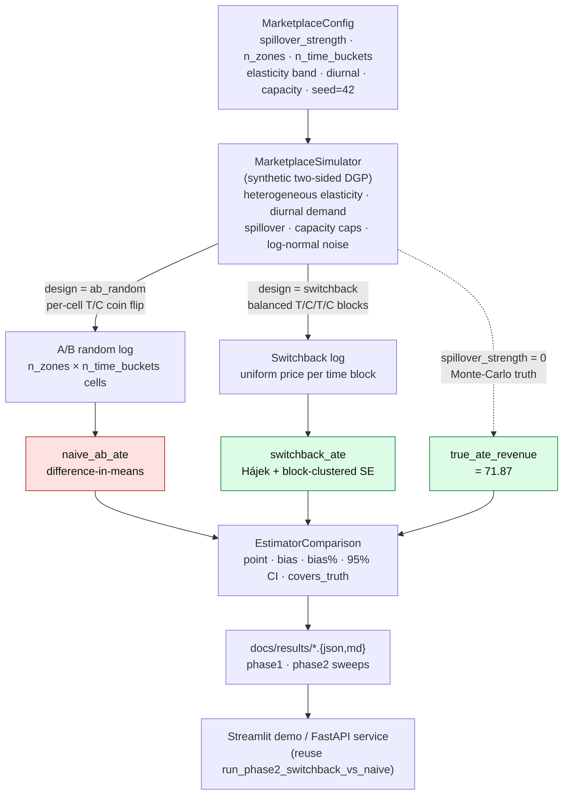

<div align="center">

# pricing-lab

### Causal-first dynamic pricing — proving naive A/B testing is secretly broken under spillover, and switchback design fixes it.

[](https://www.python.org/downloads/)
[](LICENSE)
[](BUILD_PLAN.md)
[](https://github.com/sandroama/pricing-lab/actions/workflows/ci.yml)
[](dashboard/app.py)
[](https://docs.astral.sh/ruff/)

[**Build plan**](BUILD_PLAN.md) · [**Research questions**](docs/research_questions.md) · [**Architecture**](docs/architecture.md) · [**Evaluation report**](docs/EVALUATION_REPORT.md) · [**Next steps**](NEXT_STEPS.md) · [**Usage**](docs/USAGE.md) · [**API**](docs/API.md)

</div>

---

## Headline results

**Same data-generating process. Same sample size. No model training.** Under heavy network spillover, naive A/B difference-in-means recovers only **17.5% of the true ATE**; a switchback Hájek design recovers it within **3.9%**.

| Spillover strength | Naive A/B bias | Switchback Hájek bias | Gap |
|---|---:|---:|---:|
| 0.00 (none) | 15.9% | 3.9% | **−12.0 pp** |
| 0.15 | 32.1% | 3.9% | **−28.2 pp** |
| 0.35 | 52.2% | 3.9% | **−48.3 pp** |
| 0.50 | 66.0% | 3.9% | **−62.1 pp** |
| 0.70 (heavy) | **82.5%** | **3.9%** | **−78.6 pp** |

> True ATE = **71.87** revenue/cell (paired potential-outcome truth under common random numbers, MC SE ≈ 0.12). At heavy spillover, naive A/B reports **12.57** (82.5% low) while switchback reports **69.06** (3.9% low). Naive bias scales **monotonically** with spillover — SUTVA violation made measurable — while switchback stays flat. All numbers are deterministic given `seed=42` and reproduce from `make phase1 && make phase2`. Per-row JSON: [`docs/results/phase2_switchback_vs_naive.json`](docs/results/phase2_switchback_vs_naive.json).

**Phases 4–6 extend the same lab to continuous prices, heterogeneous segments, and real data:**

| Phase | Setting | Measured headline | Raw results |
|---|---|---|---|
| **4 — Double ML** | Continuous price confounded by zone × hour (synthetic, 20 replicates) | Naive OLS gets the elasticity **sign wrong in 20/20 replicates** (mean bias +3.31); cross-fitted `LinearDML` mean bias **−0.003**, RMSE 0.027 | [`phase4_dml.json`](docs/results/phase4_dml.json) |
| **5 — heterogeneous pricing** | Per-zone elasticity (`CausalForestDML`) → bounded revenue optimizer (synthetic, 20 replicates) | Segment-specific pricing recovers **+5.8% revenue** [95% CI +4.3%, +7.3%] over the best uniform price — matching the +6.0% oracle ceiling | [`phase5_hetero.json`](docs/results/phase5_hetero.json) |
| **6 — real data** | 115,201 Citi Bike trips (JC, Sep 2024), walk-forward naive vs adjusted | Estimators **disagree by 0.53 min** (naive −1.61 vs adjusted −2.15 on e-bike trip duration) — real composition confounding, measured and explained | [`phase6_realdata.json`](docs/results/phase6_realdata.json) |

*This is a pure-CPU study — not hardware-blocked. Phases 1–5 are synthetic (labeled as such); Phase 6 is real public data. Every number above traces to a per-replicate JSON under [`docs/results/`](docs/results/).*

### Why causal inference

Every other skill in this portfolio — model training, serving, quantization —
answers "*what does the data say?*". Pricing decisions need "*what happens if
we intervene?*", and that question breaks the default tools: naive A/B is 82%
wrong under spillover (Phase 2), naive OLS points the demand curve the wrong
way under confounded pricing (Phase 4), and on real Citi Bike data the
walk-forward adjusted estimate comes out a third larger than the naive group
comparison (Phase 6). The lab
shows the failure *and* the repair — switchback designs, cross-fitted Double
ML, heterogeneous effects feeding a constrained optimizer — with ground truth
held by construction so every bias claim is measured, not asserted.

---

## Quickstart (30 seconds)

```bash
git clone https://github.com/sandroama/pricing-lab.git && cd pricing-lab
python3.12 -m venv .venv && source .venv/bin/activate
make install-dev
make smoke      # ≤2s end-to-end: runs Phase 1 + Phase 2, asserts switchback beats naive
make test       # 49 fast tests (estimators + reproducibility + phase 4–6 + dashboard + RI)
```

Reproduce the headline table, then explore interactively:

```bash
make phase1     # writes docs/results/phase1_naive_ab.{json,md}
make phase2     # writes docs/results/phase2_switchback_vs_naive.{json,md}
make phase2-adjusted  # clustered regression-adjustment precision audit
pip install -e ".[causal]"   # EconML — needed for phases 4–5 only
make phase4     # OLS vs Double ML elasticity → docs/results/phase4_dml.{json,md}
make phase5     # segment pricing optimizer → docs/results/phase5_hetero.{json,md}
make phase6     # Citi Bike real data → docs/results/phase6_realdata.{json,md}
make ui         # Streamlit demo (8 tabs) on http://localhost:8501
make api        # FastAPI service + OpenAPI docs on http://localhost:8000/docs
```

---

## Streamlit dashboard

`make ui` serves eight tabs. Every number shown is either computed live from
sidebar knobs (Live demo) or read **verbatim** from the committed
[`docs/results/*.json`](docs/results/) — the phase tabs do no recomputation:

| Tab | Reads | Shows |
|---|---|---|
| **Live demo** | — (computes live) | Naive vs switchback head-to-head on your own knobs |
| **Phase-2 sweep** | `phase2_switchback_vs_naive.json` | Bias vs spillover strength, per-estimator lines |
| **Phase 2b — precision** | `phase2_regression_adjusted.json` | Cluster-aware SE, RMSE, coverage, and the measured negative precision result |
| **Phase 4 — Double ML** | `phase4_dml.json` | Per-replicate OLS-vs-DML bias strip plot + bias summary table |
| **Phase 5 — segment pricing** | `phase5_hetero.json` | Per-replicate uplift distribution vs oracle + policy comparison |
| **Phase 6 — real data** | `phase6_realdata.json` | Naive vs walk-forward fold estimates (±1.96·SE CIs) + composition diagnostics |
| **Methodology / About** | — | Design prose, honest caveats, project context |

If a results JSON is absent (fresh clone before running the phase scripts),
the tab degrades to a friendly empty state pointing at the right `make`
target. To refresh a README/Space screenshot: `make ui`, open
`http://localhost:8501`, select the tab, and capture the browser window.

---

## Pipeline



The DGP is *the lab*. Its knobs (`spillover_strength`, `n_zones`, `switchback_block_hours`) set the experimental conditions; the two estimators are pure functions on a `DataFrame` and never see what generated it. See [`docs/architecture.md`](docs/architecture.md) for the spillover-mechanism and bias-vs-spillover diagrams.

---

## What this project claims

> **Headline (Phase 2, 4-week horizon, n=8 zones, 5,376 cells):** naive A/B
> difference-in-means under-estimates the true revenue ATE **monotonically as
> spillover grows — from 16% bias (no spillover) to 82% bias (heavy
> spillover).** Switchback Hájek stays **constant at 3.9% bias** across the
> same sweep. Same DGP. Same sample size. No model training. No econometrics
> library required.

The reasoning: in a two-sided marketplace with network effects, raising price
in zone A leaks demand into nearby zone B. SUTVA — the assumption underlying
naive A/B — is violated by construction. Switchback designs flip the *whole
platform* on a time-block schedule, so spillover happens *within* a treatment
cell and is captured by the estimator instead of biasing it.

---

## Three pre-registered research questions

- **RQ-P1.** Does the magnitude of naive A/B bias on revenue scale predictably
  with spillover strength on the simulated marketplace? → **Yes, monotonically** (Phase 1 ✓).
- **RQ-P2.** Does switchback Hájek bring the bias below 10% across the
  spillover-strength sweep? → **Yes, constant 3.9%** (Phase 2 ✓).
- **RQ-P3.** What happens to switchback bias as the time-block size shrinks
  toward 1 hour (per-hour switching) — does it collapse back to naive A/B? →
  **Measured (Phase 3): hypothesis falsified.** The curve is *non-monotone* — a
  diurnal-aliasing spike at `block_hours=4` (359% bias), not a graceful collapse
  ([`phase3_block_size.md`](docs/results/phase3_block_size.md)).

See [`docs/research_questions.md`](docs/research_questions.md) for full pre-registration.

---

## Why switchback works here (and the honest caveat)

- **SUTVA holds across blocks.** A treatment block has uniform price across all
  zones, so no within-block spillover can leak between treatment and control.
- **Daily blocks eliminate diurnal aliasing.** A 24-hour block spans an integer
  number of diurnal cycles, so block-mean revenue isn't biased by which hours
  fell in the block.
- **Balanced alternation** (`T C T C ...` with a randomized start) guarantees
  equal exposure across days of the week, eliminating day-of-week confounding.

**Caveat (published, not hidden):** the Hájek estimator clusters at the block
level. With 4 weeks of data and 24-hour blocks, that's only 28 blocks — so the
estimator is **unbiased but underpowered** (SE ≈ 2.0 on a true ATE ≈ 70). A
real deployment would want 8+ weeks or a regression-adjusted estimator that
exploits the larger cell-level sample. Full discussion in the
[**evaluation report**](docs/EVALUATION_REPORT.md).

---

## What's inside

```
pricing-lab/
├── src/pricelab/
│   ├── simulation/marketplace.py    # synthetic DGP — heterogeneous elasticity,
│   │                                #   spillover, capacity, diurnal demand
│   ├── estimators/ate.py            # naive A/B (diff-in-means) + switchback Hájek
│   ├── estimators/dml.py            # naive OLS vs LinearDML/CausalForestDML elasticity
│   ├── evaluation/compare.py        # Phase-1 / Phase-2 head-to-head harness
│   ├── realdata.py                  # Citi Bike walk-forward naive-vs-adjusted (Phase 6)
│   └── api/main.py                  # FastAPI service
├── dashboard/app.py                 # Streamlit demo (Live demo · Sweep · Phases 4–6 · Methodology · About)
├── hf_space/                        # Hugging Face Spaces entry point (re-exports dashboard/app.py)
├── scripts/                         # smoke + phase runners → docs/results/*.json
├── tests/                           # pytest (49 fast tests)
└── docs/                            # architecture · EVALUATION_REPORT · USAGE · API · DEVELOPMENT
```

**Layered design** — each layer is independently testable: (1) **Simulation** is
the DGP-as-lab; (2) **Estimators** are pure functions returning an `AteResult`
with its own analytic SE; (3) **Evaluation** holds the truth and both estimator
results in one `EstimatorComparison`; (4) **Service** is a thin FastAPI/Streamlit
wrapper over the same entry point. New estimators (DML, causal forest) are a
drop-in. Details: [`docs/architecture.md`](docs/architecture.md).

---

## Why this project exists in the portfolio

The other portfolio projects (`finops-agent`, `sceneiq`, `graphrag-citations`,
`turbokv-thesis`) are built on the identity *"efficient, grounded, multimodal AI
systems for financial and enterprise intelligence."* This project adds the
missing leg: **causal-first marketplace experimentation**.

It targets the JDs that wanted causal inference + A/B testing + uplift modeling:
**Metropolis** (centerpiece), **Amazon Robotics** (digital-twin
counterfactuals), **Spotify** (uplift in personalization), **Two Sigma**
(alt-data + walk-forward).

The angle: most pricing portfolios show "I built a forecaster." This one shows
"**I know why the forecaster's pricing recommendation is wrong**, and I have a
credible design that fixes it."

---

## Roadmap

- **Phase 3** (measured ✓, `make phase3`) — swept
  `switchback_block_hours ∈ {1, 2, 4, 8, 24}` at heavy spillover. **Finding
  overturned the hypothesis:** bias vs. block size is *non-monotone* — a diurnal
  **aliasing spike at `block_hours=4` (359% bias)** while neighbouring block
  sizes stay within ~5% of the truth. Reported honestly in
  [`docs/results/phase3_block_size.md`](docs/results/phase3_block_size.md); the
  practical lesson is that sub-day blocks need hour-of-day stratification, and a
  full-cycle 24h block is both unbiased and tightest-SE.
- **Phase 3b** (measured ✓, `make phase3b`) — the fix the aliasing spike calls
  for, tested as a falsifiable claim over 50 seeds. Strict-alternation 4h
  blocks: RMSE 261, **0% CI coverage**, and hour-of-day regression adjustment
  is *structurally unidentified* (treatment collinear with hour, 50/50 seeds).
  Daily-stratified randomization + hour/zone adjustment restores the daily-block
  anchor: RMSE 1.86, 94% coverage
  ([`docs/results/phase3b_stratified_switchback.md`](docs/results/phase3b_stratified_switchback.md)).
- **Phase 2c** (measured ✓, `make phase2-ri`) — randomization-inference audit of
  the clustered CIs on 100 seeds: permutation intervals and truth-null p-value
  uniformity cross-check the Welch/CR1 intervals without any variance estimator
  ([`docs/results/phase2c_randomization_inference.md`](docs/results/phase2c_randomization_inference.md)).
- **Phase 4** (measured ✓, `make phase4`) — continuous-price DGP with
  zone × hour confounded pricing. Naive OLS estimated a **positive** elasticity
  in 20/20 replicates (mean bias +3.31); cross-fitted `EconML.LinearDML` mean
  bias −0.003, RMSE 0.027
  ([`docs/results/phase4_dml.md`](docs/results/phase4_dml.md)).
- **Phase 5** (measured ✓, `make phase5`) — `CausalForestDML` per-zone
  elasticities → bounded scipy revenue optimizer. Segment-specific pricing
  +5.8% revenue [CI +4.3%, +7.3%] vs best uniform, ~at the oracle ceiling
  ([`docs/results/phase5_hetero.md`](docs/results/phase5_hetero.md)).
- **Phase 6** (measured ✓, `make phase6`) — real Citi Bike data (JC, Sep 2024,
  115k trips), walk-forward naive vs adjusted on the e-bike duration effect:
  estimators disagree by 0.53 min, explained by member/casual composition. No
  price in the public feed → no elasticity claimed
  ([`docs/results/phase6_realdata.md`](docs/results/phase6_realdata.md)).

See [BUILD_PLAN.md](BUILD_PLAN.md) for week-by-week milestones and
[NEXT_STEPS.md](NEXT_STEPS.md) for the exact next-milestone runbook.

---

## License

MIT (this repo). **Third-party data:** Phase 6 uses public Citi Bike trip data (downloaded separately, never committed), subject to the [NYC Bike Share data use policy](https://citibikenyc.com/data-sharing-policy). All pip dependencies keep their own licenses.
