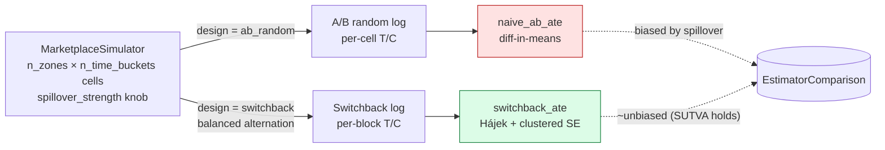
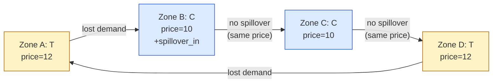
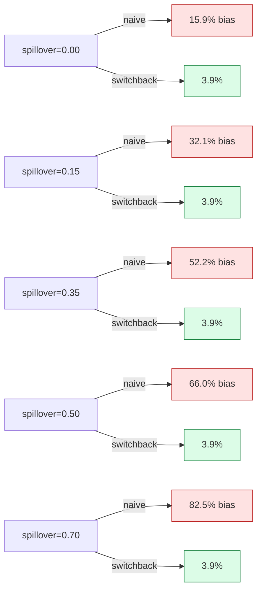

# Architecture — pricing-lab

```
            ┌────────────────────────────────────────┐
            │  FastAPI service                       │
            │  /v1/simulate  /v1/estimate/*  /v1/compare │
            └────────────────┬───────────────────────┘
                             │
                             ▼
            ┌────────────────────────────────────────┐
            │  evaluation/compare.py                 │
            │  Phase-1 / Phase-2 head-to-head harness│
            └──────────┬─────────────────────┬───────┘
                       │                     │
                       ▼                     ▼
          ┌────────────────────┐   ┌──────────────────────┐
          │ simulation/        │   │ estimators/ate.py    │
          │ marketplace.py     │   │                      │
          │                    │   │  naive_ab_ate        │
          │  • heterogeneous   │   │  switchback_ate      │
          │    elasticity      │   │  AteResult           │
          │  • diurnal demand  │   │                      │
          │  • spillover       │   │  (clustered SE,      │
          │  • capacity caps   │   │   95% CI, bias %)    │
          │  • log-normal noise│   │                      │
          │                    │   │                      │
          │  designs:          │   └──────────────────────┘
          │    ab_random       │
          │    switchback      │
          │      (balanced     │
          │       alternation)  │
          └──────────┬─────────┘
                     │
                     ▼
          ┌─────────────────────┐
          │ SimulationLog       │
          │   .df               │
          │   .true_ate_revenue │
          └─────────────────────┘
                     │
                     ▼
          ┌─────────────────────────────────┐
          │ docs/results/                   │
          │   phase1_naive_ab.{json, md}    │
          │   phase2_switchback_vs_naive.{json, md} │
          └─────────────────────────────────┘
```

## Layered design

Four layers, each independently testable and ablatable:

1. **Simulation** — synthetic two-sided marketplace with controlled SUTVA
   violations. The DGP is *the lab*: its knobs (`spillover_strength`,
   `n_zones`, `n_time_buckets`, `switchback_block_hours`) are what produce
   the experimental conditions.
2. **Estimators** — pure functions on `pandas.DataFrame`. No side effects,
   no model state. Each estimator owns its own analytic SE.
3. **Evaluation** — Phase-1 / Phase-2 head-to-head harness. Holds the
   *truth* (closed-form analytic + Monte Carlo at spillover=0) and the
   estimator results in one comparison.
4. **Service** — FastAPI thin wrapper. The dashboard reuses the same
   `run_phase2_switchback_vs_naive` entry point, so anything in the UI is
   directly callable over HTTP.

## Why this layout

- **DGP-first.** Most pricing demos start from a regression model and call
  the simulated data "synthetic." Here the DGP is the deliverable — every
  paper-worthy claim is "switchback recovers the truth that *this DGP*
  encodes."
- **Pure estimators.** `naive_ab_ate` and `switchback_ate` take a
  `DataFrame` and return an `AteResult`. They don't know what generated
  the data. This makes adding new estimators (DML, causal forest in Phase
  4) a drop-in.
- **Reproducible.** All sweeps live in `scripts/`, write to
  `docs/results/`, and are picked up by the portfolio aggregator.
- **Honest.** The result tables published in the README report **both**
  estimators on **every** spillover level, with bias signed. No
  cherry-picking.

---

## Visual diagrams (Mermaid)

These render natively on GitHub. The ASCII diagram above is the portable
plain-text version.

### Two-design comparison



### Spillover mechanism (why naive A/B fails)



Under switchback, *all zones in a block share the same price*, so no
price differential exists between neighbors → no spillover → SUTVA holds.

### Bias vs. spillover (the headline)


